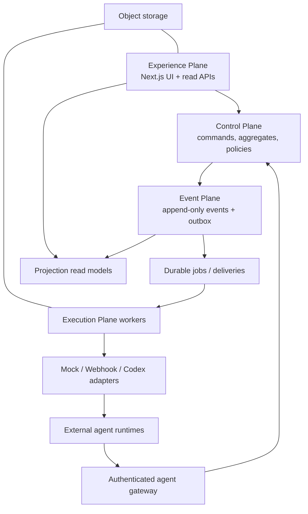

# Mission Control — Production Architecture Proposal

**Status:** Approved for Phase 1 — 2026-07-18

**Date:** 2026-07-18

**Decision style:** Domain-neutral modular monolith first, replaceable adapters at external boundaries

## Goals and non-goals

The production system coordinates heterogeneous agents through one domain-neutral mission core. It accepts real missions, plans structured tasks, dispatches external executions, records authenticated progress, enforces policies and approvals, recovers from failure, and derives every user-visible fact from an immutable event history.

Phase 1 does not build every adapter, autonomous DeFi execution, a general workflow designer, multi-region infrastructure, or independent microservices. The existing demo remains available through a deterministic mock adapter and a versioned software-delivery template.

## Approved Phase 1 decisions

1. **Modular monolith:** Keep one TypeScript codebase, but separate control, event, execution, and experience modules with dependency rules. Split services only when measured operational needs justify it.
2. **PostgreSQL as the production system of record:** Use transactions, unique constraints, row locking, JSONB event payloads, and projection tables. Retain the DynamoDB adapter as a legacy demo adapter during migration, not as the target production model.
3. **Transactional outbox plus database-backed jobs:** Commit domain events and effect intents atomically; workers claim jobs with leases. Avoid Redis/Kafka until throughput or isolation requires them.
4. **At-least-once delivery with idempotent consumers:** Do not claim exactly-once external effects. Use command, callback, delivery, and execution idempotency keys plus adapter reconciliation.
5. **External worker for Codex:** The web application never spawns Codex or arbitrary commands. An isolated worker accepts a constrained execution request and reports versioned events/artifacts.
6. **Versioned event and execution protocols:** Existing `1.0` demo events remain readable. New production events use an explicit envelope and schema registry; upcasters preserve rebuild compatibility.

### Phase 2 controlled Codex execution decision — 2026-07-18

Phase 2 instantiates the existing execution-plane boundary for one adapter. Agent and repository registries are workspace-scoped policy records; a versioned Execution aggregate is canonical for attempts; high-volume heartbeats use an operational table; Codex runs only in a separate leased worker and generated Git worktree; large/redacted evidence uses checksummed artifact storage. The web tier never spawns processes. Local commit is the maximum permitted side effect: push, merge, deployment, destructive commands, secrets access, public callbacks, and other adapters remain outside the boundary. Full lifecycle, safety, recovery, and deployment decisions are in `docs/PHASE_2_CODEX_EXECUTION.md`. 7. **Deterministic authority:** State machines, dependencies, policy decisions, and health signals are deterministic. Models may propose plans or explain evidence but cannot directly mutate authoritative state. 8. **DeFi analysis-only boundary:** Initial DeFi templates may retrieve, analyze, and simulate. Transaction signing and submission are prohibited.

## Four-layer architecture



### Control Plane

Owns commands and deterministic rules for missions, tasks, dependencies, registrations, assignment, executions, approvals, policies, schedules, health, retries, pause/cancel, and audit access. Route handlers translate authenticated requests into commands; they do not perform orchestration decisions themselves.

### Event Plane

Owns immutable event append, optimistic aggregate versions, schema validation, correlation/causation, idempotent command records, transactional outbox entries, projection checkpoints, rebuilds, and audit retention. Corrections are new events.

### Execution Plane

Owns adapter configuration validation, dispatch, polling, callback normalization, heartbeats, timeout detection, retry classification, cancellation, artifact transfer, and delivery history. Workers run independently from the web tier and use leases, bounded retries, backoff, and dead-letter states.

### Experience Plane

Reads projection tables and subscribes to projected changes. It owns presentation and ephemeral UI state only. It may issue commands but contains no transition, policy, assignment, or health authority.

## Module boundaries

Proposed top-level code boundaries for Phase 1 (exact filenames are implementation-plan details):

- `domain/`: aggregate types, state machines, dependency resolution, policy inputs, health signals.
- `application/`: command handlers, orchestration services, ports, transaction boundary.
- `events/`: envelope, schemas, registry, append API, upcasters, projectors.
- `execution/`: adapter interface, worker jobs, retry/cancellation, callback normalization.
- `infrastructure/`: PostgreSQL, object storage, secret provider, queue/jobs, telemetry.
- `experience/`: Next.js routes/components consuming command and query APIs.
- `templates/`: versioned mission templates with no engine branching by domain.

Domain and application modules must not import Next.js, AWS SDKs, Codex, or vendor payload types.

## Domain model

All identifiers are opaque UUIDs. Timestamps are UTC ISO-8601 at protocol boundaries and timezone-aware database timestamps internally.

- **Mission:** identity, workspace, template/version, name/objective/description/domain, priority/risk, requested outcome, success criteria, constraints, budget, deadline, creator, status, aggregate version.
- **Task:** mission, instructions, expected output, priority/risk, required capabilities, max attempts, timeout, approval and verification requirements, status. Dependencies are explicit edges, not an embedded status shortcut.
- **Agent:** workspace, adapter type, endpoint/runtime reference, capabilities, domains, trust, status, heartbeat, concurrency, configuration reference, credential reference, cost metadata. Raw secrets are forbidden.
- **Execution:** immutable attempt number plus lifecycle state, task/agent/mission references, external execution ID, lease, heartbeat, input snapshot, output summary, error classification, usage/cost, idempotency key.
- **Artifact:** execution reference, kind, media type, object-store/external reference, checksum, size, summary, provenance, retention and access metadata.
- **Approval:** requested action, policy/risk explanation, evidence references, requester, state, expiration, decision actor/reason/time, and the aggregate version on which the request was based.
- **Policy:** versioned deterministic rules and defaults selected by workspace/template. Decisions are recorded as evidence-bearing events.
- **Schedule:** template/input reference, timezone-aware rule, enabled state, concurrency and missed-run policy. Each run creates a new mission.

## State machines

Task states:

```text
pending -> blocked | ready | cancelled
blocked -> ready | cancelled
ready -> assigned | cancelled
assigned -> running | ready | cancelled
running -> waiting_for_approval | paused | verifying | failed | cancelled
waiting_for_approval -> running | failed | cancelled
paused -> running | cancelled
verifying -> completed | failed | waiting_for_approval
failed -> ready (retry/reassign, attempts remaining) | cancelled
completed and cancelled are terminal
```

Execution states:

```text
requested -> accepted | failed | cancelled
accepted -> running | failed | timed_out | cancelled
running -> waiting_for_approval | paused | succeeded | failed | timed_out | cancelled
waiting_for_approval -> running | failed | cancelled
paused -> running | cancelled
succeeded, failed, timed_out, and cancelled are terminal for that attempt
```

Each transition is a pure function of current aggregate version, command, and evidence. Invalid transitions return typed conflicts and append nothing. Completing a task reevaluates its dependents in the same command transaction. A retry creates a new Execution; it never rewinds the prior attempt.

## Canonical event envelope

```json
{
  "eventId": "uuid",
  "eventVersion": 1,
  "eventType": "execution.started",
  "aggregateType": "execution",
  "aggregateId": "uuid",
  "aggregateVersion": 3,
  "missionId": "uuid",
  "workspaceId": "uuid",
  "correlationId": "uuid",
  "causationId": "uuid-or-null",
  "actor": { "type": "human|agent|system|scheduler", "id": "uuid" },
  "occurredAt": "2026-07-18T12:00:00.000Z",
  "payload": {},
  "metadata": { "schema": "execution.started@1", "traceId": "..." }
}
```

Payload schemas disallow unknown security-sensitive fields by default. Event identity is globally unique; `(aggregate_type, aggregate_id, aggregate_version)` is unique. Personally identifiable data, secrets, raw prompts, chain-of-thought, and large artifact bodies do not belong in events.

Initial catalog:

- Mission: `mission.created`, `mission.planning_requested`, `mission.planned`, `mission.paused`, `mission.resumed`, `mission.completed`, `mission.cancelled`, `mission.failed`.
- Task/dependency: `task.created`, `dependency.added`, `task.ready`, `task.assigned`, `task.started`, `task.blocked`, `task.progress_reported`, `task.verification_requested`, `task.completed`, `task.failed`, `task.cancelled`, `task.retried`, `task.reassigned`.
- Agent/execution: `agent.registered`, `agent.configuration_validated`, `agent.status_changed`, `execution.requested`, `execution.accepted`, `execution.started`, `agent.heartbeat_received`, `execution.progress_reported`, `execution.paused`, `execution.resumed`, `execution.succeeded`, `execution.failed`, `execution.timed_out`, `execution.cancelled`.
- Tool/artifact: `tool_call.requested`, `tool_call.authorized`, `tool_call.rejected`, `artifact.produced`, `usage.recorded`.
- Approval/policy: `policy.evaluated`, `approval.requested`, `approval.granted`, `approval.denied`, `approval.expired`.
- Operations: `delivery.requested`, `delivery.succeeded`, `delivery.failed`, `job.dead_lettered`, `schedule.created`, `schedule.updated`, `schedule.triggered`.

The legacy demo catalog (`plan.created`, `recommendation.triggered`, and related types) remains supported through a `demo.v1` template and projector until intentionally retired.

## Execution protocol 1.0

Protocol messages use JSON Schema and a discriminator `messageType`. Every inbound message includes `protocolVersion`, `messageId`, `executionId`, `missionId`, `taskId`, `attempt`, `occurredAt`, and `idempotencyKey`. Messages are authenticated and authorized against the registered agent and current execution.

Supported messages:

- `execution.request`: objective, instructions, expected output, immutable constraint/tool/policy/context snapshots, callback configuration.
- `execution.acceptance`: external execution ID and accepted/rejected status.
- `execution.heartbeat`: external status and optional lease extension request.
- `execution.progress`: bounded summary, percentage/phase, evidence references.
- `artifact.submission`: metadata, checksum, size, provenance, upload/external reference.
- `approval.request`: proposed action, policy input, risk explanation, evidence.
- `execution.completion`: output summary, verification evidence, usage and cost.
- `execution.failure`: stable error code, retryability claim, sanitized detail.
- `execution.cancellation`: acknowledged cancellation and final external status.

Adapters translate vendor payloads into this protocol. Vendor payloads never enter the domain core.

## Agent adapter contract

```ts
interface AgentAdapter {
  validateConfiguration(agent: Agent): Promise<ValidationResult>;
  startExecution(request: ExecutionRequest): Promise<ExecutionHandle>;
  getExecutionStatus(handle: ExecutionHandle): Promise<ExecutionStatus>;
  cancelExecution(handle: ExecutionHandle): Promise<void>;
  sendMessage?(handle: ExecutionHandle, message: AgentMessage): Promise<void>;
}
```

- `mock`: deterministic clock-controlled demo and test behavior.
- `webhook`: signed outbound request, asynchronous signed callback, delivery history, idempotency, bounded retries.
- `codex`: isolated worker/worktree, fixed executable/configuration, constrained repository scope, artifacts and tests reported through the protocol. It is not linked into the web server.

Hermes, Lambda, polling, and MCP runtimes are future adapters, not branches in orchestration logic.

## Persistence and consistency

Recommended PostgreSQL tables include `events`, `aggregate_heads`, `commands`, `outbox`, `projection_checkpoints`, mission/task/agent/execution/approval/artifact projections, `webhook_deliveries`, `idempotency_records`, `jobs`, `dead_letters`, policies, templates, and schedules.

A command transaction:

1. Authenticates and authorizes actor/workspace.
2. Claims the command idempotency key.
3. Loads aggregate events at an expected version.
4. Validates state transition, dependencies, and policy.
5. Appends events with unique aggregate versions.
6. Writes outbox/job intents and critical synchronous projection updates.
7. Commits once.

Projectors are idempotent and checkpoint by event position. All projections can be dropped and rebuilt. Long rebuilds create shadow tables and swap only after counts/checksums and smoke queries pass.

## Background job semantics

Workers claim jobs with `FOR UPDATE SKIP LOCKED`, a lease owner, and lease expiration. Jobs have stable idempotency keys, bounded attempts, jittered exponential backoff, typed retryability, correlation IDs, and a terminal dead-letter record. Graceful shutdown stops new claims and either completes or releases leases. A reconciliation job detects expired leases, stale heartbeats, and external executions whose status diverges from Mission Control.

## Policies and approvals

Policy evaluation occurs before dispatching a risky tool/effect and again immediately before applying an approval. An approval binds to action parameters, evidence hashes, policy version, and aggregate version; stale approvals cannot authorize changed actions.

Initial hard boundaries:

- Software: approval before merge, production deploy/infrastructure mutation, secret access/rotation, or destructive database action.
- DeFi: analysis and simulation only. Signing, submitting, moving funds, swaps, LP changes, and on-chain policy changes are denied—not merely approval-gated—in the initial release.
- Systems: read/diagnose/report may proceed; restart, scale, network/permission mutation, and deletion require approval.

## Deterministic mission health

Health consumes failed tasks, heartbeat freshness, blocked critical path, approval age, budget use, deadline slack, agent availability, and retry count. A versioned calculator emits evidence references, thresholds, and confidence. An LLM may explain those signals but cannot set authoritative health.

## Threat model and controls

| Threat                     | Required control                                                                                                            |
| -------------------------- | --------------------------------------------------------------------------------------------------------------------------- |
| Unauthorized human command | OIDC session, workspace ownership, RBAC, CSRF protection, command audit.                                                    |
| Forged/replayed callback   | Per-agent credentials, HMAC/JWS signature, timestamp window, nonce/message id, idempotency, execution authorization.        |
| Duplicate external action  | Transactional outbox, stable idempotency key, adapter reconciliation, parameter-bound approval.                             |
| Arbitrary code in web tier | No shell/process API in web; isolated Codex worker with fixed entrypoint, sandbox/worktree, allowlists and resource limits. |
| Secret disclosure          | Secret-provider references, least privilege, rotation, log redaction, no secrets in events/artifacts/database records.      |
| Cross-workspace access     | Workspace ID on every record/event, authorization in command/query layer, database constraints and tests.                   |
| Malicious agent payload    | Strict schemas/size limits, output encoding, event-type allowlist, state-machine validation, artifact scanning.             |
| Confused-deputy approval   | Display exact action/evidence; bind approval to immutable action hash and version; expire and reject stale approvals.       |
| Autonomous financial loss  | Initial deny policy for signing/submission and absence of wallet keys in Mission Control.                                   |
| Audit tampering            | Append-only permissions, backups/PITR, integrity checks, restricted correction events, audit access logging.                |

## Observability

Every API request, job, adapter call, event, and projection carries correlation/trace context and relevant mission/task/execution/agent IDs. JSON logs include duration, retry count, error class, model, tokens, and estimated cost where applicable. Metrics cover queue age, dispatch latency, callback failures, stale heartbeats, timeouts, dead letters, projection lag, approval age, and budget consumption. OpenTelemetry-compatible trace and error-reporting hooks are introduced without logging sensitive content.

Separate liveness and readiness endpoints cover web, database, migration compatibility, worker leases, and projector lag.

## Mission templates

Templates are immutable versioned data defining tasks, dependency edges, capabilities, verification rules, approval defaults, and parameter schemas. A mission references the exact template version used.

Initial templates:

- `software-delivery@1`: analyze → inspect → plan → implement → test → review → approval → delivery artifact.
- `defi-analysis@1`: portfolio/data → risk/fees/IL → candidates → simulation → policy verification → approval-ready recommendation; no execution task exists.
- `systems-monitoring@1`: signals → anomaly → evidence → severity → remediation proposal → conditional approval → verification → incident report.

The existing Stripe Billing flow becomes `demo-stripe-billing@1` backed by the mock adapter so its pacing and truth labels remain stable.

## Migration and compatibility strategy

1. Freeze golden demo event streams and projection snapshots.
2. Introduce the v2 envelope and PostgreSQL store beside the current event-store interface.
3. Make the mock demo write and rebuild through the new store in a non-production environment.
4. Prove projection equality and the full demo regression suite.
5. Cut production writes to PostgreSQL behind a feature flag; keep DynamoDB read-only for legacy mission links during an agreed retention window.
6. Remove web-process execution only after the worker path passes restart, duplicate-delivery, timeout, and cancellation tests.

No existing event payload is silently rewritten. Migration emits import metadata and preserves original IDs/timestamps. Rollback reverts application routing, not committed canonical history.

## Deferred implementation details

- Production managed PostgreSQL provider; local development uses PostgreSQL 16 in Docker Compose.
- Future multi-user OIDC provider. Phase 1 uses one environment-configured user, a signed secure session cookie, one seeded default workspace, and owner/member authorization enforced server-side.
- Production event/audit retention and legal deletion requirements.
- Object store, encryption, malware scanning, artifact maximums, and retention.
- Whether existing DynamoDB demo URLs require long-lived compatibility.
- Planning authority: deterministic template only in Phase 1 versus constrained LLM plan proposal plus deterministic validation.
- Live update transport: short polling initially versus server-sent events after read models exist.
- Exact per-agent credential and signature format for webhook callbacks.
- Deployment topology for the first Codex worker and its repository credential boundary.

## Approval record

Phase 0 and the Phase 1 architecture were explicitly approved on 2026-07-18. The approval authorizes Phase 1 only. External agent execution remains blocked until the Phase 1 boundary is reviewed.
