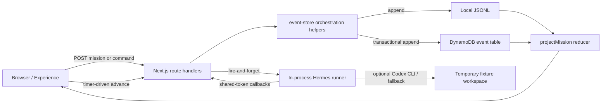

# Mission Control — Production Gap Analysis

**Status:** Phase 0 audit complete; architecture review required

**Audit date:** 2026-07-18

**Scope:** Repository and local runtime at commit `ba1b178`

## Executive conclusion

Mission Control is a strong, deployed demonstration with a real append-only event spine, deterministic projections, a durable DynamoDB adapter, and an honestly labeled fallback artifact path. It is not yet a production control plane. The current domain is one scripted mission, its lifecycle is advanced by browser timers, its agent boundary uses one shared bearer token, and its bounded Codex runner may be started as untracked work inside the web process.

The safest evolution is incremental: preserve the current demo as a `mock` adapter and software-delivery template, establish a production event and state-machine contract around it, then move execution into a durable worker boundary. A broad rewrite would risk the strongest proven property—the event-derived demo—without first supplying equivalent durability and tests.

## Audit method and baseline

The audit covered all repository-owned application, library, adapter, infrastructure, test, fixture, documentation, and video source files. Generated dependencies and build output were inventoried but not source-reviewed. No application code was changed.

Validation run on 2026-07-18:

| Check                                     | Result            | Evidence / limitation                                                                                                                                                               |
| ----------------------------------------- | ----------------- | ----------------------------------------------------------------------------------------------------------------------------------------------------------------------------------- |
| `npm run typecheck`                       | Pass              | TypeScript completed without errors.                                                                                                                                                |
| `npm test`                                | Pass              | 8/8 Node tests passed: rebuild, refresh, append idempotency, concurrent advance, assignment claim, and preview behavior.                                                            |
| `npm run build`                           | Pass              | Next.js 16.2.10 production build completed; 12 routes emitted.                                                                                                                      |
| Local production server                   | Pass with warning | `/`, `/api/health`, and mission creation returned 200/200/201. `next start` warns it is incompatible with `output: standalone`; the container uses the standalone server correctly. |
| `npm run lint`                            | Fail              | `next lint` is no longer a valid Next.js 16 command and is interpreted as a nonexistent `lint` directory. There is currently no working lint gate.                                  |
| `npm audit --omit=dev --audit-level=high` | Pass              | Zero reported vulnerabilities.                                                                                                                                                      |
| Runtime version                           | Mismatch          | Audit shell used Node 20.11.1; README and container require Node 22. AWS SDK warns future releases require Node 22.                                                                 |
| Visual browser rehearsal                  | Not rerun         | HTML and HTTP behavior were checked; interaction, responsive layout, accessibility, console, and network behavior require a browser QA pass.                                        |

The local smoke test created one JSONL audit mission. Local JSONL is development data and is not committed.

## Current architecture and data flow

1. The launch page posts objective, deadline, and priority to `POST /api/missions`.
2. The server generates a random mission ID and appends `mission.created`.
3. The mission page reads all mission events and rebuilds `MissionProjection` in memory.
4. Client timers call `/advance`; the server selects the next entry from a hard-coded event template sequence.
5. At the scripted assignment boundary, the route starts `runCodexPricingTask` without awaiting or durably enqueueing it.
6. Hermes polls and claims its single known assignment using a shared bearer token, runs Codex in a temporary fixture or copies a validated fallback, then posts canonical events.
7. Local development rewrites one JSONL file per append. Production uses a DynamoDB transaction for sequence metadata, event storage, and an event-ID idempotency marker.
8. The UI polls the canonical stream every 750 ms and derives Mission Plan, Mission Health, artifacts, approvals, and debrief from `projectMission`.

## Capability classification

### Fully functional and proven

- Append-only, ordered, mission-scoped event recording behind an `EventStore` boundary.
- DynamoDB conditional sequence allocation and mission-scoped event-ID idempotency.
- Projection rebuild from the ordered event stream with equality tests.
- Refresh-safe mission reconstruction and duplicate approval protection.
- Isolated mission IDs and mission-specific event streams.
- A polished launch → crisis → recommendation → approval → debrief demo experience.
- Authenticated agent assignment, claim, and ingestion routes when the shared token is configured.
- Bounded fixture execution with an allowlisted edit contract, independent validation, timeouts, and honest live/fallback provenance.
- AWS deployment definitions for HTTPS, ECS health checks and rollback, retained encrypted DynamoDB, Secrets Manager injection, and CloudWatch logs.

### Demo-only, simulated, or controlled

- Mission planning, task creation, timing, delay, health changes, optimization, completion duration, and estimated savings are fixed templates.
- Browser timers, not a scheduler or orchestration worker, advance the mission.
- Only one software-delivery scenario and one Hermes/Codex pricing task exist.
- Agent roster, capabilities, dependencies, estimates, and assignment decisions are projection constants rather than durable domain records.
- Public production disables live Codex; the normal hosted path copies and validates a known fallback.
- Mission debrief metrics (`14m 52s`, `7m`, one decision) are fixed UI text rather than evidence-calculated values.
- Replay is documented but absent.

### Hard-coded

- Four plan rows, owner names, task IDs, event ordering, task instructions, allowed paths, validation command, and recommendation numbers.
- Agent lookup accepts only `hermes`.
- Approval supports only the reorganization event at one exact position in the controlled sequence.
- Infrastructure names, domain, AWS region assumptions, demo TTL, single replica, and public demo configuration.
- Mission health is a reducer over specific event messages, including string comparisons such as `Mission is on track`.

### In-memory or process-local

- JSONL append serialization uses a process-local promise map and rewrites the entire event file; it is unsuitable for multiple processes or crash-safe production writes.
- Every projection is rebuilt by reading the full stream; there are no durable projection checkpoints or read models.
- Hermes execution ownership, timeout handling, and completion tracking are not durable.
- Codex workspaces live under the OS temporary directory and are not cleaned up or retained as managed artifacts.
- Client command-pending state and mission progression timers disappear on refresh or process termination.

### Not authenticated or insufficiently authorized

- Human UI and mission command routes have no authentication, workspace ownership, authorization, CSRF protection, or role model.
- An unguessable mission ID functions as access control for reads and approval/advance commands.
- Agent routes use a single static bearer token for every agent and mission; comparison is not constant-time and there is no rotation, scope, expiration, signature, replay window, or per-agent identity.
- Inbound agent events are not authorized against the claimed execution, assignment, allowed event types, or legal state transition.
- No rate limiting or abuse controls are present.

### Missing persistence

- Missions, tasks, agents, executions, approvals, artifacts, schedules, policies, webhook deliveries, idempotent commands, and projection checkpoints have no production read-model storage.
- DynamoDB demo events expire after seven days, which is incompatible with a complete production audit trail.
- Artifact bodies and immutable checksums are not retained; only small metadata is placed in events.
- No database migrations, projection version registry, seed command, or projection rebuild command exists.
- There is no command/outbox record proving an external effect was dispatched exactly once.

### Missing failure handling and operability

- Fire-and-forget execution from `/advance` can be lost on web process restart and may run more than once across replicas.
- No durable queue, retry classification, exponential backoff, dead-letter queue, lease, heartbeat monitor, cancellation, pause, reassign, or manual retry.
- Failed Codex execution silently selects a fallback; platform execution failure is not modeled separately from demo recovery.
- State transitions are implicit in event order and reducer conditionals; invalid transitions are not systematically rejected.
- Dependency readiness is not calculated.
- Health reflects scripted events, not heartbeats, deadlines, attempts, budgets, approvals, or agent availability.
- Health endpoint checks the event store but there is no separate readiness endpoint or worker health.
- Logs are only partially structured; there are no metrics, traces, error-reporting hooks, delivery history, or redaction policy enforcement.
- No scheduler, missed-run policy, concurrency control, or recurring mission instances.
- No disaster-recovery rehearsal beyond the documented demo persistence test.

## Production-model gaps

| Required concept | Current representation                          | Production gap                                                                                      |
| ---------------- | ----------------------------------------------- | --------------------------------------------------------------------------------------------------- |
| Mission          | Minimal launch fields in `mission.created`      | Domain, outcome, criteria, constraints, budget, risk, ownership, aggregate version, lifecycle.      |
| Task             | A few event subjects and one assignment payload | Instructions, output contract, dependencies, readiness, attempts, timeout, approvals, verification. |
| Agent            | Producer IDs and one Hermes route               | Registry, adapter configuration, capabilities, trust, health, concurrency, credential reference.    |
| Execution        | Implied by task events                          | First-class attempt, external ID, lease, heartbeat, usage, cost, failure, idempotency.              |
| Artifact         | Metadata inside an event                        | Durable metadata/read model, checksum, object-store reference, access control, retention.           |
| Approval         | One recommendation event                        | Request/decision aggregates, expiration, evidence, policy decision, denial, stale request behavior. |

The current event envelope also lacks explicit aggregate type/ID/version and actor fields named according to the production brief. `producer` and `subject` partially encode those concepts, but a versioned compatibility design is required rather than an in-place rename.

## Security and threat findings

Highest-priority threats are unauthorized human commands, forged or replayed agent callbacks, duplicate external execution, arbitrary process execution in the web tier, cross-workspace data access, secret leakage, and autonomous high-risk actions. The current bounded prompt and fixture reduce shell exposure for the demo, but the architecture still permits the web process to spawn a configurable command. Production must move that responsibility to an isolated worker with a fixed adapter contract and least-privilege credentials.

The initial DeFi boundary must be analysis and simulation only. Transaction signing, submission, fund movement, LP changes, swaps, and policy changes remain prohibited until a separately reviewed approval and custody design exists.

## Behavior that must not regress

1. Launch reaches a mission shell immediately and does not duplicate a mission on refresh.
2. Mission Plan, Mission Log, Mission Health, recommendation, approval, artifacts, and debrief remain projections of canonical events.
3. Rebuild from an empty projection produces the same visible state.
4. Event append, mission advancement, assignment claim, and approval remain idempotent under retries and concurrency.
5. The demo still earns its recommendation through an on-track state and a visible critical-path delay.
6. One approval atomically changes real projected organization state.
7. Simulated, controlled, fallback, and live execution remain visibly distinct.
8. No raw prompts, chain-of-thought, secrets, or arbitrary tool payloads enter the Mission Log.
9. The bounded ServicePilot checkout preview and its validation remain intact.
10. A completed mission survives application replacement in the durable environment.
11. Public web routes never expose a general shell, arbitrary repository path, or arbitrary agent prompt.
12. The three-minute demo remains available through a deterministic mock path while production capabilities are introduced.

## Recommended priority

The first production slice should not be a new screen or a second domain. It should make the existing scenario survive process failure with explicit state machines and a durable dispatch/outbox boundary. That creates the foundation on which authenticated webhook and Codex adapters, approvals, scheduling, and additional templates can safely build.

## Phase 0 exit blockers

- Review and approve the proposed architecture decisions in `docs/PRODUCTION_ARCHITECTURE.md`.
- Choose the durable database/queue deployment shape (recommended: PostgreSQL plus a transactional outbox and database-backed jobs for the first production slice).
- Choose the human identity provider and workspace boundary.
- Decide production audit retention and artifact storage/retention policy.
- Decide whether DynamoDB demo streams are migrated, retained as legacy demo data, or allowed to expire.
